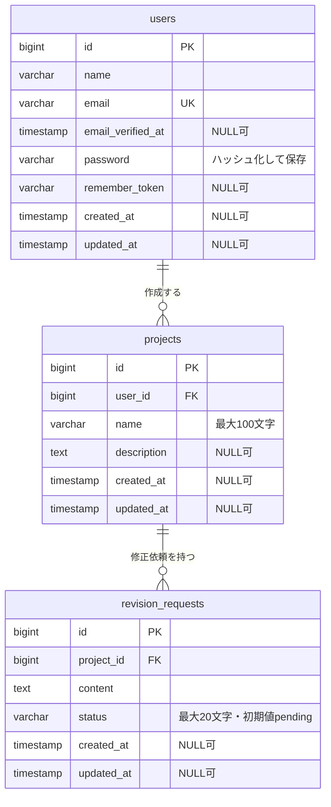

# 案件・修正依頼管理

Web制作の案件と修正依頼をまとめて管理するアプリです。PHP・Laravelの学習を兼ねて作成しました。

## 機能

- ログイン・ログアウト（公開ユーザー登録なし）
- 案件の登録・一覧表示・詳細表示
- 修正依頼の追加と対応状況の変更（未対応／対応中／完了）
- 案件の作成者だけが閲覧・操作できるアクセス制御
- 入力内容のチェックとログイン試行回数の制限

## 起動方法

PHP 8.3以上（pdo_sqlite拡張）とComposerが必要です。Laravel 13、Blade、SQLiteを使用しています。アプリの起動にNode.jsやフロントエンドのビルドは不要です。Bladeの整形・チェックにはNode.jsとnpmを使用します。

```sh
composer install
cp .env.example .env
php artisan key:generate
php -r "file_exists('database/database.sqlite') || touch('database/database.sqlite');"
php artisan migrate --seed
php artisan serve --host=127.0.0.1 --port=8000
```

http://127.0.0.1:8000 にアクセスします。
ローカル環境用のアカウントは以下のとおりです。

- メールアドレス：`demo@example.com`
- パスワード：`local-demo-password`

このアカウントは、`APP_ENV=local` の場合にのみ作成されます。公開環境では使用しないでください。

## コードチェック・テスト

PHPの書式チェックにはLaravel Pint、Bladeの整形にはblade-formatter、静的解析にはLarastan（PHPStanのLaravel向け拡張）を使用しています。Larastanは `app` ディレクトリを対象にレベル5で解析します。設定は `phpstan.neon` に記載しています。

初回は `npm ci` でBladeフォーマッターをインストールしてください。Bladeの整形設定は `.bladeformatterrc.json` に記載しています。

```sh
# PHP・Bladeの書式チェックと静的解析をまとめて実行
composer lint

# PHPの書式チェックのみ
composer lint:style

# Bladeの書式チェックのみ
composer lint:blade

# 静的解析のみ
composer lint:types

# PHP・Bladeの書式を自動修正（ファイルを変更します）
composer format

# 動作テスト
composer test
```

## 開発の経緯

Web制作の業務では、案件ごとに発生する修正依頼と、その対応状況を整理することに課題を感じていました。そこで、案件と修正依頼をまとめて確認できるように、PHP・Laravelの勉強を兼ねて管理アプリを作りました。

まずは「案件を登録し、修正依頼を追加して対応状況を変更する」という基本的な流れに機能を絞りました。一つの案件に複数の修正依頼を登録し、それぞれの対応状況を確認できます。

実装を通じて、認証、データの関連付け、入力検証、アクセス制御、テストなど、バックエンド開発の基本を学ぶことも目的としています。現在はローカル環境で動作する初期版で、業務での運用はまだ行っていません。

## 初期版の範囲

画面は、ログイン・案件一覧・案件詳細の3つです。ログイン後、自分の案件を登録し、案件ごとに修正依頼を追加できます。

顧客用アカウント、担当者の割り当て、コメント、ファイルの添付、通知、変更履歴は、今後の拡張候補としています。初期版には、ユーザーの新規登録や案件・修正依頼の削除機能も含めていません。

## 技術選定

| 技術 | 採用理由 |
| --- | --- |
| PHP・Laravel | 業務上の課題を題材に、認証、入力検証、DB操作などを学ぶため |
| Blade | Laravel内で画面を作り、画面とサーバー処理のつながりを追いやすくするため |
| SQLite | 別途DBサーバーを用意せず、ローカルで起動できるようにするため |
| 静的CSS | フロントエンドのビルドを不要にし、小さな構成にするため |
| PHPUnit | 正常な操作に加え、権限違反や不正な入力を検証するため |

## ER図

主要な3つのテーブルの関係を示しています。セッションやキャッシュなど、Laravelが使用する補助テーブルは省略しています。データ型はマイグレーションの定義に基づいており、SQLite内部の型表現とは異なります。



GitHubなど、Mermaidに対応したMarkdownビューアーで図として表示できます。

## テーブルの関係と設計理由

- 一人のユーザーが複数の案件を登録できます。各案件には必ず一人の作成者が紐づきます。
- 一つの案件に複数の修正依頼を登録できます。各修正依頼は必ず一つの案件に紐づきます。案件や修正依頼がまだ登録されていない状態も扱えます。
- 案件の情報と修正依頼の内容を分けて管理するため、それぞれ別のテーブルに保存しています。
- `projects.user_id` は、案件の作成者を確認するために使います。案件の登録時に、ログインユーザーのIDをサーバー側で設定します。
- `revision_requests` には `user_id` を保存せず、紐づく案件を通じて作成者を確認します。
- 外部キー制約により、存在しないユーザーや案件への関連付けを防いでいます。
- 外部キーには連動削除を設定しています。ユーザーを削除するとその案件も、案件を削除するとその修正依頼も削除されます。ただし、初期版の画面には削除機能を用意していません。

## 対応状況と入力ルール

| 保存値 | 画面表示 |
| --- | --- |
| pending | 未対応 |
| in_progress | 対応中 |
| completed | 完了 |

データベースに保存する値と画面上の日本語表示を分けています。修正依頼を追加したときの初期状態は「未対応」です。対応の再開や入力の訂正ができるよう、3つの状態の間で自由に変更できます。

入力項目には、以下のルールを設けています。

| 項目 | 入力ルール |
| --- | --- |
| 案件名 | 必須、最大100文字 |
| 案件の説明 | 任意、最大2,000文字 |
| 修正内容 | 必須、最大2,000文字 |
| 対応状況 | 未対応・対応中・完了のいずれか |

対応状況の値はアプリ側で検証しています。データベースの `status` 列には、値を3種類に限定するCHECK制約は設定していません。

## アクセス制御

案件一覧には、ログインユーザーが作成した案件だけを表示します。案件の詳細表示、修正依頼の追加、対応状況の更新時にも作成者を確認し、他のユーザーの案件にアクセスした場合は404を返します。

対応状況の更新時には、修正依頼がURLで指定された案件に紐づいていることも確認します。これにより、別の案件の修正依頼IDを指定して更新する操作を防いでいます。

## 動作確認

実装時に、自動テスト7件（44項目の検証）とPintの書式チェックが通ることを確認しました。Larastanの静的解析（レベル5）もエラーなしで通っています。主な検証内容は以下のとおりです。

- 未ログイン時のアクセス制限とログイン・ログアウト
- 案件の登録、修正依頼の追加、対応状況の更新、各画面の表示
- フォームの送信内容を変更しても、案件の作成者や修正依頼の初期状態を上書きできないこと
- 他のユーザーの案件を閲覧・変更できないこと
- 空の入力、長すぎる案件名、不正な対応状況を拒否すること
- 案件と修正依頼の組み合わせが不正な場合に更新を拒否すること

## 今後の改善

今後は業務の流れに沿って使い勝手を確認し、必要な機能を少しずつ追加していく予定です。

- 対応状況で絞り込めるようにし、未対応の修正依頼を見つけやすくします。
- 変更履歴を残し、いつ対応状況が変わったか確認できるようにします。
- 複数人での利用に向けて、担当者の設定や権限管理を検討します。

機能の改善を通じてPHP・Laravelへの理解を深め、変更に合わせて入力検証やアクセス制御のテストも追加していきます。
